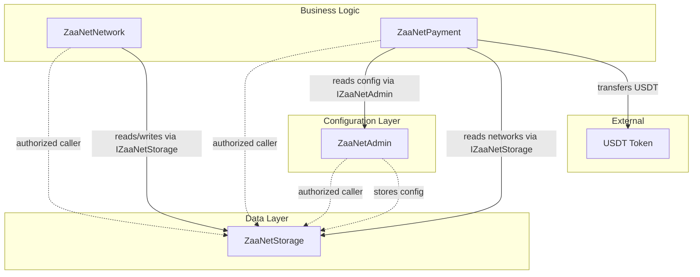

# ZaaNet Smart Contracts

> A decentralized WiFi sharing infrastructure platform built on Arbitrum, enabling secure network hosting, payment processing, and network management through smart contracts.

## Overview

ZaaNet is a comprehensive smart contract ecosystem that provides:

- **Decentralized Network Management**: Register and manage network nodes
- **Automated Payment Processing**: Handle USDT-based payments with configurable fees
- **Secure Access Control**: Role-based permissions and multi-contract authorization
- **Treasury Management**: Centralized fee collection and distribution
- **Modular Architecture**: Separate contracts for storage, admin, network, and payments

## Table of Contents

- [Architecture](#-architecture)
- [Contracts Overview](#-contracts-overview)
- [Prerequisites](#-prerequisites)
- [Installation](#-installation)
- [Deployment](#-deployment)
- [Configuration](#-configuration)
- [Usage Examples](#-usage-examples)
- [API Reference](#-api-reference)
- [Security Features](#-security-features)
- [Testing](#-testing)
- [Contributing](#-contributing)
- [License](#-license)

## Architecture



The ZaaNet ecosystem follows a modular architecture:

1. **ZaaNetStorage**: Central data repository for all contract states
2. **ZaaNetAdmin**: Administrative functions, fee management, and configuration
3. **ZaaNetNetwork**: Core network operations and node management
4. **ZaaNetPayment**: Payment processing and USDT handling

## Contracts Overview

### ZaaNetStorage
**Purpose**: Centralized storage contract that holds all data for the ZaaNet ecosystem.

**Key Features**:
- Secure data storage with access control
- Cross-contract data sharing
- Authorized caller management
- Event logging for data changes

**Access Control**: Only authorized contracts can read/write data.

### ZaaNetAdmin  
**Purpose**: Administrative control center for the entire ZaaNet platform.

**Key Features**:
- Platform configuration management
- Fee structure control (platform fee percentage, hosting fees)
- Treasury and payment address management
- Administrative role management
- System-wide parameter updates

**Configuration Parameters**:
- Platform Fee: `10%` (configurable)
- Hosting Fee: `2 USDT` (configurable)
- Treasury Address: Centralized fee collection
- Payment Contract Address: Authorized payment processor

### ZaaNetNetwork
**Purpose**: Core network management and node operations.

**Key Features**:
- Node registration and management
- Network topology handling
- Service discovery mechanisms
- Node status tracking and monitoring
- Integration with storage and admin systems

**Dependencies**: Requires ZaaNetStorage and ZaaNetAdmin for full functionality.

### ZaaNetPayment
**Purpose**: Handles all payment processing using USDT tokens.

**Key Features**:
- USDT-based payment processing
- Automatic fee calculation and distribution
- Payment verification and validation
- Treasury integration
- Transaction history and receipts

**Token Support**: USDT (Arbitrum Sepolia: `0x438C411f9aEFDd02D90C31Dc24bC1380c08934Cd`)

## Prerequisites

- **Node.js**: v18.0.0 or higher
- **npm** or **yarn**: Latest version
- **Hardhat**: Development environment
- **Wallet**: With Arbitrum Sepolia ETH for gas fees
- **USDT**: Test tokens for payment functionality

### Required Accounts
1. **Deployer Wallet**: For contract deployment
2. **Treasury Wallet**: For fee collection (`0x2652164707AA3269C83FEAA9923b0e19CacFA906`)
3. **Payment Wallet**: For payment processing (`0x79f41E312Adf15b731bFEC99675C5bE2A8A215C1`)

## Installation

### 1. Clone the Repository
```bash
git clone [https://github.com/your-org/zaanet-contracts](https://github.com/ZaaNet/zaanet-smart-contracts.git)
cd zaanet-smart-contracts
```

### 2. Install Dependencies
```bash
npm install
```

### 3. Install Hardhat Plugins
```bash
npm install --save-dev @nomicfoundation/hardhat-ignition-etherscan
npm install --save-dev @nomicfoundation/hardhat-verify
npm install --save-dev @nomicfoundation/hardhat-ignition
npm install dotenv
```

### 4. Environment Setup
Create `.env` file in project root:
```env
# Wallet Configuration
PRIVATE_KEY=your_deployer_wallet_private_key

# API Keys
ARBISCAN_API_KEY=your_arbiscan_api_key_from_mainnet_arbiscan

# Network Configuration (Optional - defaults in hardhat.config.js)
ARBITRUM_SEPOLIA_RPC=https://sepolia-rollup.arbitrum.io/rpc
```

**Security Notes**:
- Never commit `.env` to version control
- Add `.env` to your `.gitignore`
- Use separate wallets for different environments

## Deployment

### Hardhat Configuration
Ensure your `hardhat.config.js` includes:

```javascript
require("@nomicfoundation/hardhat-toolbox");
require("@nomicfoundation/hardhat-ignition-etherscan");
require("@nomicfoundation/hardhat-verify");
require("dotenv").config();

module.exports = {
  solidity: {
    version: "0.8.28",
    settings: {
      optimizer: {
        enabled: true,
        runs: 200,
      },
    },
  },
  networks: {
    arbitrumSepolia: {
      url: process.env.ARBITRUM_SEPOLIA_RPC || "https://sepolia-rollup.arbitrum.io/rpc",
      accounts: [process.env.PRIVATE_KEY],
      chainId: 421614,
    },
  },
  etherscan: {
    apiKey: {
      arbitrumSepolia: process.env.ARBISCAN_API_KEY,
    },
    customChains: [
      {
        network: "arbitrumSepolia",
        chainId: 421614,
        urls: {
          apiURL: "https://api-sepolia.arbiscan.io/api",
          browserURL: "https://sepolia.arbiscan.io/",
        },
      },
    ],
  },
  ignition: {
    requiredConfirmations: 1,
  },
};
```

### Deploy All Contracts
```bash
npx hardhat ignition deploy ignition/modules/ZaaNetDeploymentModule.js --network arbitrumSepolia
```

### Verify All Contracts  
```bash
npx hardhat ignition verify chain-421614 --network arbitrumSepolia
```

### Deployment Verification
Check deployment success:
```bash
# View deployed addresses
cat ignition/deployments/chain-421614/deployed_addresses.json

# Check contracts on Arbiscan
# Visit: https://sepolia.arbiscan.io/address/YOUR_CONTRACT_ADDRESS
```

## Configuration

### Current Configuration (Arbitrum Sepolia)

| Parameter | Value | Description |
|-----------|--------|-------------|
| **Test USDT** | `0x438C411f9aEFDd02D90C31Dc24bC1380c08934Cd` | Test USDT token contract |
| **Treasury** | `0x2652164707AA3269C83FEAA9923b0e19CacFA906` | Fee collection wallet |
| **Payment Contract** | `0x79f41E312Adf15b731bFEC99675C5bE2A8A215C1` | Payment processor address |
| **Platform Fee** | `10%` | Platform commission on transactions |
| **Hosting Fee** | `2 USDT` | Fixed fee for node hosting |

### Modifying Configuration

To change configuration parameters, update the `ZaaNetDeploymentModule.js` file:

```javascript
// Configuration - Update these addresses as needed
const testUSDTAddress = "0x438C411f9aEFDd02D90C31Dc24bC1380c08934Cd";
const treasuryAddress = "0x2652164707AA3269C83FEAA9923b0e19CacFA906";  
const paymentAddress = "0x79f41E312Adf15b731bFEC99675C5bE2A8A215C1";
const platformFeePercent = 10; // 10% platform fee
const hostingFee = 2 * (10 ** 6); // 2 USDT (with 6 decimals)
```

## Usage Examples

### Interacting with Contracts

#### 1. Get Contract Instances
```javascript
const { ethers } = require("hardhat");

async function getContracts() {
  // Load deployed addresses
  const addresses = require('./ignition/deployments/chain-421614/deployed_addresses.json');
  
  const storage = await ethers.getContractAt("ZaaNetStorage", addresses['ZaaNetDeploymentModule#ZaaNetStorage']);
  const admin = await ethers.getContractAt("ZaaNetAdmin", addresses['ZaaNetDeploymentModule#ZaaNetAdmin']);
  const network = await ethers.getContractAt("ZaaNetNetwork", addresses['ZaaNetDeploymentModule#ZaaNetNetwork']);
  const payment = await ethers.getContractAt("ZaaNetPayment", addresses['ZaaNetDeploymentModule#ZaaNetPayment']);
  
  return { storage, admin, network, payment };
}
```

#### 2. Register a Network (Example)
```javascript
async function registerNode() {
  const { network } = await getContracts();
  const [signer] = await ethers.getSigners();
  
  // Example node registration 
  const tx = await network.connect(signer).registerNetwork(
    "2",                             // _pricePerSession
    "68b231740c3179292b451969",      // _mongoDBId
    "active"                         // status
  );
  
  await tx.wait();
  console.log("Node registered successfully!");
}
```

#### 3. Process Payment (Example)
```javascript
async function processPayment(contractId, amount, voucherId) {
  const { payment } = await getContracts();
  const [signer] = await ethers.getSigners();
  
  // First approve USDT spending
  const usdt = await ethers.getContractAt("IERC20", "0x438C411f9aEFDd02D90C31Dc24bC1380c08934Cd"); // Use the address of the Test USDT

  await usdt.connect(signer).approve(payment.address, amount);
  
  // Process payment
  const tx = await payment.connect(signer).processPayment(contractId, amount, voucherId);
  await tx.wait();
  
  console.log("Payment processed successfully!");
}
```

#### 4. Check Admin Configuration
```javascript
async function checkConfig() {
  const { admin } = await getContracts();
  
  const platformFee = await admin.platformFeePercent();
  const hostingFee = await admin.hostingFee();
  const treasury = await admin.treasuryAddress();
  
  console.log(`Platform Fee: ${platformFee}%`);
  console.log(`Hosting Fee: ${ethers.formatUnits(hostingFee, 6)} USDT`);
  console.log(`Treasury: ${treasury}`);
}
```

#### 5. Check Host Earnings and Statistics
```javascript
async function getHostStats(hostAddress) {
  const { storage } = await getContracts();
  
  // Get host earnings
  const earnings = await storage.getHostEarnings(hostAddress);
  
  // Get host's networks
  const networkIds = await storage.getHostNetworks(hostAddress);
  
  // Get platform stats
  const totalPayments = await storage.totalPaymentsAmount();
  const totalWithdrawals = await storage.totalWithdrawalsAmount();
  const totalHosting = await storage.totalHostingAmount();
  const zaanetEarnings = await storage.getZaaNetEarnings();
  
  console.log("Host Statistics:", {
    hostAddress,
    earnings: ethers.formatUnits(earnings, 6) + " USDT",
    networkCount: networkIds.length,
    networkIds: networkIds.map(id => id.toString()),
    platformStats: {
      totalPayments: ethers.formatUnits(totalPayments, 6) + " USDT",
      totalWithdrawals: ethers.formatUnits(totalWithdrawals, 6) + " USDT", 
      totalHosting: ethers.formatUnits(totalHosting, 6) + " USDT",
      zaanetEarnings: ethers.formatUnits(zaanetEarnings, 6) + " USDT"
    }
  });
  
  return {
    earnings,
    networkIds,
    totalPayments,
    totalWithdrawals, 
    totalHosting,
    zaanetEarnings
  };
}
```

## API Reference

### ZaaNetStorage

#### Core Data Structures
```solidity
struct Network {
    uint256 id;
    address hostAddress;
    uint256 pricePerSession;
    string mongoDataId;
    bool isActive;
    uint256 createdAt;
    uint256 updatedAt;
}
```

#### Access Control Functions
- `setAllowedCaller(address _caller, bool status)` - **Owner only**: Authorize/deauthorize contract access
- `setAllowedCallers(address[] calldata _callers, bool status)` - **Owner only**: Batch set allowed callers

#### Network Management Functions
- `incrementNetworkId()` - **Authorized callers only**: Get next network ID and increment counter
- `setNetwork(uint256 id, Network calldata net)` - **Authorized callers only**: Create or update network
- `getNetwork(uint256 id)` - **View**: Get network details by ID
- `getNetworksPaginated(uint256 offset, uint256 limit)` - **View**: Get paginated list of networks
- `getHostNetworks(address hostAddress)` - **View**: Get all network IDs for a specific host

#### Earnings Management Functions  
- `increaseHostEarnings(address hostAddress, uint256 amount)` - **Authorized callers only**: Add to host earnings
- `getHostEarnings(address hostAddress)` - **View**: Get total earnings for a host
- `increaseZaaNetEarnings(uint256 amount)` - **Authorized callers only**: Add to platform earnings
- `getZaaNetEarnings()` - **View**: Get total platform earnings

#### Statistics Functions
- `updateTotalPaymentsAmount(uint256 amount)` - **Authorized callers only**: Update total payments processed
- `updateTotalWithdrawalsAmount(uint256 amount)` - **Authorized callers only**: Update total withdrawals
- `updateTotalHostingAmount(uint256 amount)` - **Authorized callers only**: Update total hosting amount

#### Emergency Functions
- `emergencyDeactivateNetwork(uint256 networkId)` - **Owner only**: Emergency deactivate a network

#### Public State Variables
- `allowedCallers(address)`: Check if address is authorized caller
- `networkIdCounter`: Current network ID counter
- `totalPaymentsAmount`: Total amount processed through payments
- `totalWithdrawalsAmount`: Total amount processed through withdrawals  
- `totalHostingAmount`: Total amount processed through hosting
- `zaanetEarnings`: Total earnings for ZaaNet platform
- `networks(uint256)`: Get network by ID
- `hostEarnings(address)`: Get earnings for specific host

#### Events
- `AllowedCallerUpdated(address indexed caller, bool status)`: Emitted when caller authorization changes
- `NetworkStored(uint256 indexed id, address indexed hostAddress, uint256 pricePerSession)`: Emitted when new network is created
- `NetworkUpdated(uint256 indexed id, address indexed hostAddress)`: Emitted when network is updated
- `SessionStored(uint256 indexed sessionId, address indexed paymentAddress, uint256 amount)`: Emitted when session is stored
- `HostEarningsUpdated(address indexed hostAddress, uint256 totalEarned)`: Emitted when host earnings change
- `ZaaNetEarningsUpdated(uint256 totalEarned)`: Emitted when platform earnings change

---

### ZaaNetAdmin

#### Key Functions
- `setPlatformFee(uint256 newFeePercent)`: Update platform fee percentage
- `setHostingFee(uint256 newFee)`: Update hosting fee amount
- `setTreasuryAddress(address newTreasury)`: Change treasury wallet
- `setPaymentAddress(address newPayment)`: Update payment contract

#### Events  
- `PlatformFeeUpdated(uint256 oldFee, uint256 newFee)`
- `HostingFeeUpdated(uint256 oldFee, uint256 newFee)`
- `TreasuryAddressUpdated(address oldAddress, address newAddress)`

### ZaaNetNetwork

#### Key Functions
- `registerNetwork(...)`: Register a new network node
- `updateNetwork(...)`: Update existing node information  
- `deactivateNetwork(string nodeId)`: Deactivate a node
- `getHostedNetworkById(string nodeId)`: Retrieve node details

#### Events
- `NetworkRegistered(string indexed nodeId, address indexed owner)`
- `NetworkUpdated(string indexed nodeId, address indexed updater)`
- `NetworkDeactivated(string indexed nodeId, address indexed deactivator)`

### ZaaNetPayment

#### Core Data Structures
```solidity
struct BatchPayment {
    uint256 contractId;
    uint256 grossAmount;
    bytes32 voucherId;
}
```

#### Payment Processing Functions
- `processPayment(uint256 _contractId, uint256 _grossAmount, bytes32 _voucherId)` - **Payment address only**: Process single USDT payment with voucher validation
- `processBatchPayments(BatchPayment[] calldata payments)` - **Payment address only**: Process up to 50 payments in a single transaction

#### Security & Validation Functions
- `isVoucherProcessed(bytes32 _voucherId)` - **View**: Check if voucher has been processed (prevents double-spending)
- `getRemainingDailyLimit()` - **View**: Get remaining daily withdrawal limit
- `getTodayWithdrawals()` - **View**: Get today's total withdrawal amount

#### Administrative Functions
- `setDailyWithdrawalLimit(uint256 _newLimit)` - **Owner only**: Set daily withdrawal limit
- `withdrawToken(address _to, uint256 _amount)` - **Owner only**: Withdraw tokens (respects daily limits)
- `pause()` - **Owner only**: Pause contract operations
- `unpause()` - **Owner only**: Unpause contract operations
- `rescueERC20(address _erc20, address _to, uint256 _amount)` - **Owner only**: Emergency token rescue

#### Security Constants
- `MAX_INDIVIDUAL_PAYMENT`: 50 USDT maximum per payment
- `MAX_FEERATE_PERCENT`: 20% maximum platform fee
- `dailyWithdrawalLimit`: 10,000 USDT daily limit (configurable)

#### State Variables
- `processedVouchers(bytes32)`: Track processed vouchers to prevent double-spending
- `dailyWithdrawals(uint256)`: Track daily withdrawal amounts by day
- `dailyWithdrawalLimit`: Current daily withdrawal limit

#### Events
- `PaymentProcessed(bytes32 indexed voucherId, uint256 indexed contractId, address indexed host, address payer, uint256 grossAmount, uint256 platformFee, uint256 hostAmount, uint256 timestamp)`
- `DailyLimitExceeded(address indexed treasury, uint256 attemptedAmount, uint256 dailyLimit, uint256 alreadyWithdrawn)`
- `BatchPaymentProcessed(uint256 batchSize, uint256 totalAmount, uint256 totalPlatformFee)`

---

## Security Features

### Access Control
- **Role-based permissions**: Only authorized contracts can interact with storage
- **Multi-signature support**: Critical functions require multiple confirmations
- **Owner-only functions**: Administrative functions restricted to contract owners

### Payment Security
- **USDT integration**: Uses established ERC-20 token standard
- **Fee validation**: Automatic fee calculation prevents manipulation
- **Treasury protection**: Centralized fee collection with secure withdrawal

### Data Integrity
- **Centralized storage**: Single source of truth for all contract data
- **Event logging**: All important actions emit events for transparency
- **Input validation**: All functions validate inputs before execution

### Best Practices
- **Modular Architecture**: Contracts designed with separation of concerns and configurable parameters, allowing operational flexibility without requiring contract upgrades
- **Gas optimization**: Efficient code structure minimizes transaction costs
- **Error handling**: Comprehensive error messages and revert conditions

## Testing

### Run All Tests
```bash
npx hardhat test
```

### Test Coverage
```bash
npx hardhat coverage
```

### Test Specific Contract
```bash
npx hardhat test test/ZaaNetStorage.test.ts
npx hardhat test test/ZaaNetAdmin.test.ts
npx hardhat test test/ZaaNetNetwork.test.ts
npx hardhat test test/ZaaNetPayment.test.ts
```

## Gas Optimization

### Estimated Gas Costs (Arbitrum Sepolia)

| Operation | Estimated Gas | Cost (ETH)* |
|-----------|---------------|-------------|
| Deploy Storage | ~500,000 | ~0.001 ETH |
| Deploy Admin | ~800,000 | ~0.0016 ETH |
| Deploy Network | ~1,200,000 | ~0.0024 ETH |
| Deploy Payment | ~900,000 | ~0.0018 ETH |
| Register Network | ~80,000 | ~0.00016 ETH |
| Process Payment | ~120,000 | ~0.00024 ETH |

*Estimates based on current gas prices - actual costs may vary

### Optimization Strategies
- **Batch operations**: Group multiple actions in single transaction
- **Storage efficiency**: Minimize storage variable usage
- **Function modifiers**: Reduce code duplication
- **Event optimization**: Use indexed parameters judiciously

## Known Issues & Limitations

### Current Limitations
1. **Single USDT support**: Only supports one token type currently
3. **Network capacity**: No built-in scaling mechanisms yet

### Planned Improvements
- **Multi-token support**: Accept various ERC-20 tokens
- **Layer 2 optimization**: Further gas cost reduction
- **Enhanced monitoring**: Better network health tracking

## Roadmap

### Phase 1: Core Infrastructure 
- [x] Basic contract architecture
- [x] Storage and admin systems
- [x] Payment processing
- [x] Network management

### Phase 2: Advanced Features (In Progress)
- [ ] Multi-token payment support
- [ ] Advanced node monitoring
- [ ] Performance analytics
- [ ] Enhanced security features

### Phase 3: Scaling & Integration (Planned)
- [ ] Cross-chain compatibility
- [ ] Third-party integrations
- [ ] Mobile SDK
- [ ] Enterprise features

## Contributing

### Development Setup
1. Fork the repository
2. Clone your fork: `git clone https://github.com/YOUR_USERNAME/zaanet-smart-contracts`
3. Create feature branch: `git checkout -b feature/your-feature-name`
4. Install dependencies: `npm install`
5. Run tests: `npm test`

### Contribution Guidelines
- **Code Style**: Follow Solidity style guide
- **Testing**: All new features must include tests
- **Documentation**: Update README for any changes
- **Security**: Run security analysis before submitting

### Pull Request Process
1. Ensure all tests pass
2. Update documentation as needed
3. Add detailed PR description
4. Request review from maintainers
5. Address feedback promptly

## License

MIT License - see [LICENSE](LICENSE) file for details.

## Support & Community

### Get Help
- **Documentation**: Check this README first
- **Issues**: Open GitHub issue for bugs
- **Discussions**: Use GitHub Discussions for questions
- **Telegram**: Join our community server [Link](https://t.me/+wS2TymNwrJBmNjA0)

### Contact Information
- **Email**: zaanetconnect@gmail.com  
- **Twitter**: @ZaaNet_
- **Website**: https://zaanet.xyz

---

## Contract Addresses (Arbitrum Sepolia)

After successful deployment, your contract addresses will be:

```json
{
  "ZaaNetStorage": "0x...",
  "ZaaNetAdmin": "0x...", 
  "ZaaNetNetwork": "0x...",
  "ZaaNetPayment": "0x..."
}
```

**Verify on Arbiscan**: https://sepolia.arbiscan.io/address/YOUR_CONTRACT_ADDRESS

---

*Last updated: [Current Date] - Version 1.0.0*
